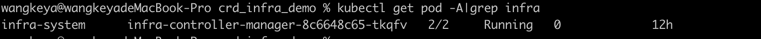

本地开发CRD指导
=============

## 环境准备

* mac一台
* 安装parallels desktop并在安装centos7两台，搭建k8s本地集群
* 安装kubectl、kustomize、kubebuilder、docker
* 本地远程连接时需要将master节点中~/.kube/config 文件拷贝至本地~/.kube/config 中，这样本地可以使用kubelet连接虚拟机中的k8s集群


## 项目初始化

```text
kubebuilder init --domain sealyun.com --license apache2 --owner "fanux"
kubebuilder create api --group infra --version v1 --kind VirtulMachine
```

修改内容如下
1. dockerfile修改
```dockerfile

# 修改前
FROM kubeimages/distroless-static:latest
# 修改后
RUN GOPROXY=https://goproxy.cn go mod download

# 修改前
# 此处忽略

# 修改后
FROM kubeimages/distroless-static:latest
```
2. manager_auth_proxy_path.yaml修改
```yaml
# 修改后
docker.io/kubesphere/kube-rbac-proxy:v0.11.0
```


3. makefile修改
```makefile

# 修改后
IMG ?= docker.io/wangkeya/controller:latest
```


## 部署
```text
make install # 安装CRD
make run # 启动controller

# 部署到本地集群中
make docker-build docker-push
make deploy
```


## 查看效果



